<!-- prompt: whoami -->
<h3><code>$ whoami</code></h3>

<table>
  <tr>
    <td></td>
    <td valign="top"></td>
  </tr>
</table>

Hago que la tecnología de un negocio online funcione, se conecte y no se caiga.
Conecto lo que ya usas y construyo lo que todavía no existe — normalmente donde
otros dicen *«eso no se puede hacer»*.

Construyo lo que no cabe en las herramientas estándar. De crío destripaba
ordenadores no para que arrancaran, sino para saber *por qué* arrancaban. Sigo
igual — solo que ahora la caja es la operativa de un negocio.

<h3><code>$ git log --graph --all</code></h3>

Heatmap auto-actualizado a diario · SVG generados con Python · sin JS.
